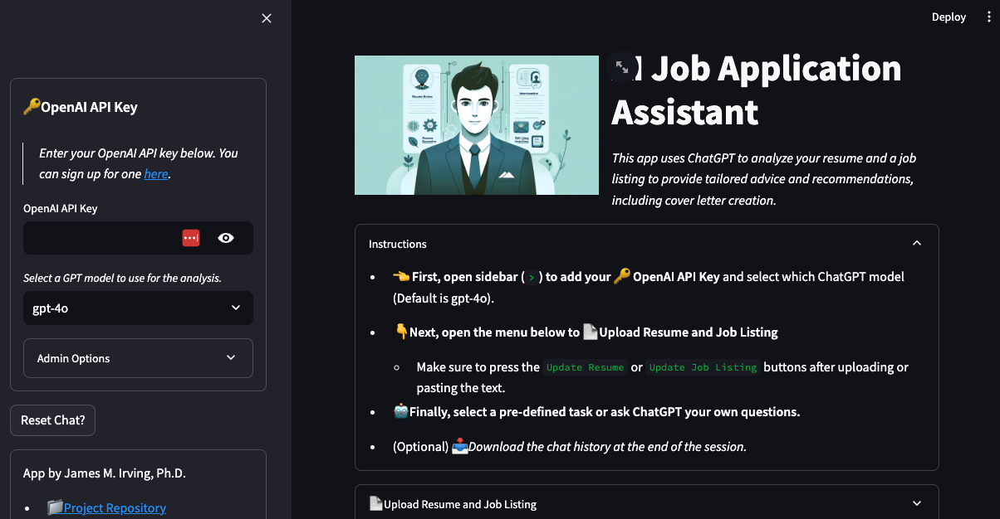

<a name='title'></a>

# job-hunting-with-ai
 
- Streamlit App: https://job-hunting-with-ai.streamlit.app/
- Video Walkthrough: https://youtu.be/CZrarP5_6Rw 
> *This app uses ChatGPT to analyze your resume and a job listing to provide tailored advice and recommendations, including cover letter creation.*




## To Do's 
- 05/15/24

- [ ] Integrate RAG with ONET daabase.
    -  Waiting for staff review of API application.
    - [ ] Review Code Examples: https://github.com/onetcenter/web-services-samples


- 05/20/24:
- [ ] Add instructions for constructing follow-up prompts (or really once you've added your PDFs).
    - [ ] $$$$ pay wall??
    


### Brainstorming

>Integrating RAG with ONET database
1. Have ChatGPT generate ~3-5 onet job titles that are similar to the job application and https://github.com/onetcenter/web-services-samples/blob/master/python-3/batch_coder.py
2. Feed the list of titles into the OnetWebService's .call:

- Example use
```python
# SOURCE: https://github.com/onetcenter/web-services-samples/blob/master/python-3/batch_coder.py
#!python3
from OnetWebService import OnetWebService
import sys
import json

# read JSON input
input = json.load(sys.stdin)

# initialize Web Services and results objects
onet_ws = OnetWebService(input['config']['username'], input['config']['password'])
max_results = max(1, input['config']['max_results'])
output = { 'output': [] }

# call keyword search for each input query
for q in input['queries']:
    res = []
    kwresults = onet_ws.call('online/search',
                             ('keyword', q),
                             ('end', max_results))
    if ('occupation' in kwresults) and (0 < len(kwresults['occupation'])):
        for occ in kwresults['occupation']:
            res.append({ 'code': occ['code'], 'title': occ['title'] })
    output['output'].append({ 'query': q, 'results': res })

json.dump(output, sys.stdout, indent=2, sort_keys=True)
```
